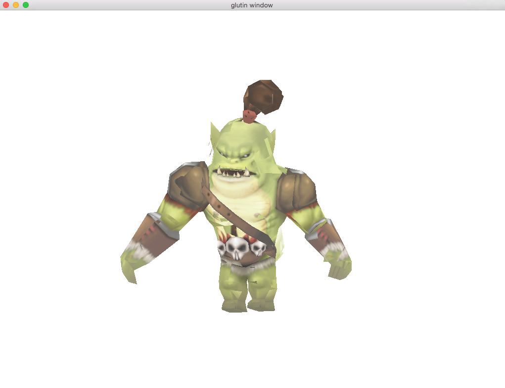

#Newton

A hobby game engine in very early stage.

##Example

use the [nightly version rust](http://www.rust-lang.org/install.html) build the example(only tested on OS X 10.10):
    cargo run --example cocos

